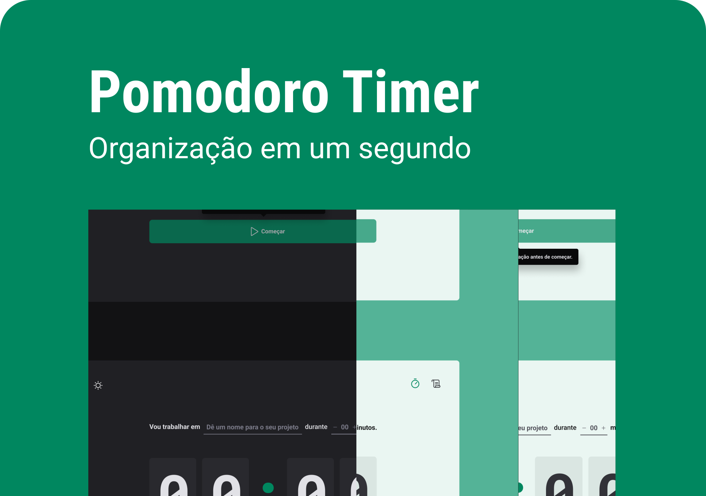

<h1 align="center">Pomodoro-Timer</h1>

Erick Marques Cabral

Esse projeto exclusivo e gratuito, promovido pela Rocketseat para ensino de tecnologias WEB.  
<a href="https://www.rocketseat.com.br/">Rocketseat🔗</a>.

  

  <a href="#-descrição">Descrição do Projeto</a>&nbsp;&nbsp;&nbsp;|&nbsp;&nbsp;&nbsp;
  <a href="#-tecnologias">Tecnologias</a>&nbsp;&nbsp;&nbsp;|&nbsp;&nbsp;&nbsp;
  <a href="#-layout">Layout</a> 

  

## 💻 Descrição
Nesse projeto, desenvolvi uma aplicação de controle de tempo no estilo **Pomodoro**, que contém as seguintes funcionalidades:

- Adicionar uma nova tarefa e o tempo que ela levará
- Listar uma tarefa com seu status
- Mostrar o progresso de conclusão, andamento ou interrompição das tarefas
- Mostrar o tempo

Apesar de serem poucas funcionalidades, precisei abordar conceitos como:

- Estados
- Imutabilidade do estado (immer)
- Listas e chaves no ReactJS
- Propriedades
- Componentização
- Reducer
- hooks
- Rotas

## 🚀 Tecnologias
Esse projeto foi desenvolvido com as seguintes tecnologias:

- HTML e CSS
- JavaScript
- Git e Github
- Figma
- Vite
- TypeScript
    
## 🔖 Layout

Você pode visualizar o layout do projeto através [DESSE LINK](https://www.figma.com/file/CTQKZ1NUrC3s02LFx8eUGN/Ignite-Timer?node-id=11%3A599&t=x4zU1Ph4djBqhXBy-1). É necessário ter conta no [Figma](https://figma.com) para acessá-lo.
